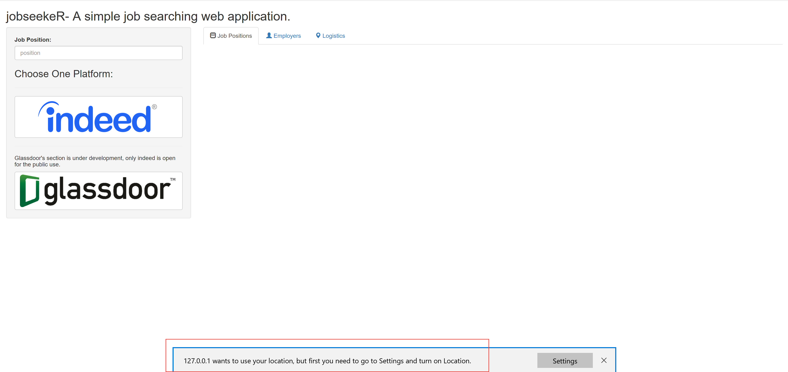
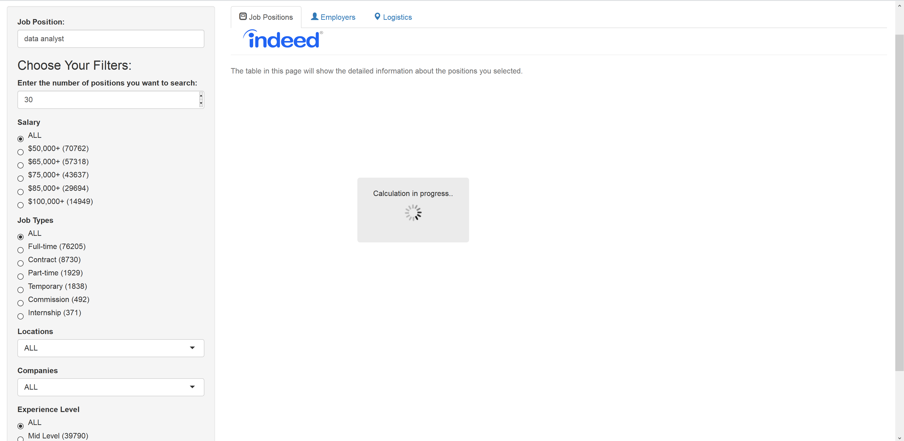
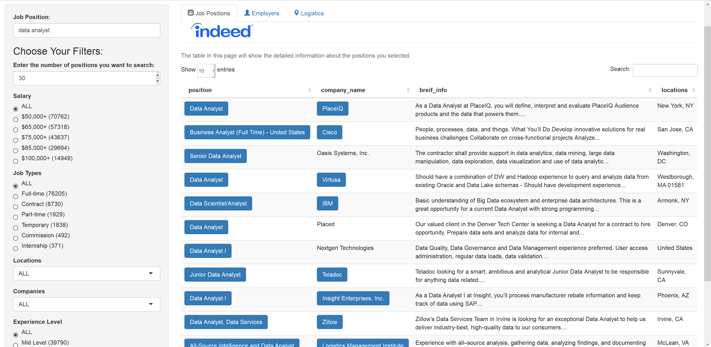
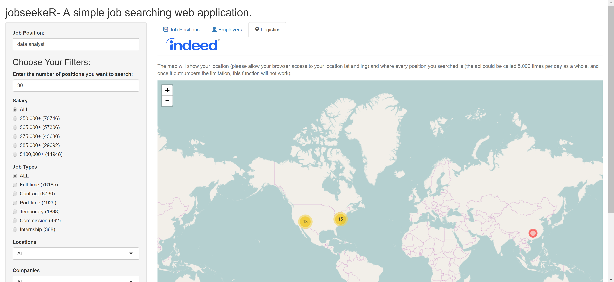
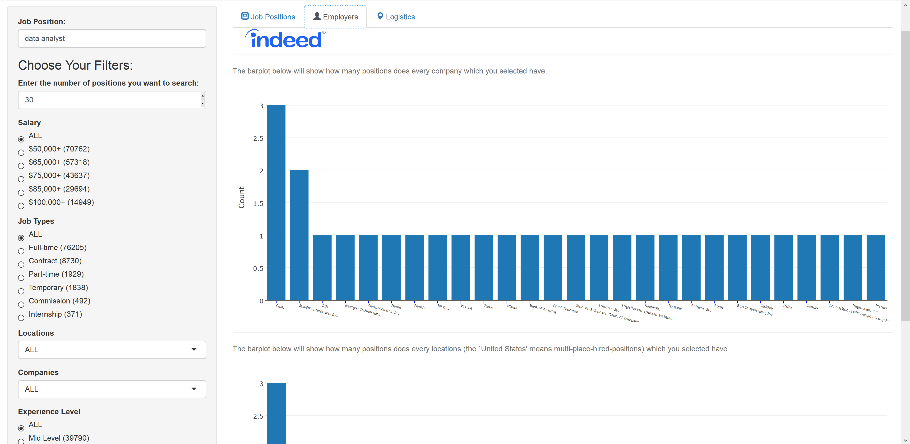

```{r setup, include=FALSE}
knitr::opts_chunk$set(echo = FALSE)
```

## Introduction

[`jobseekeR`](https://github.com/JackHo327/jobseekeR) is one of my personal side projects, and it is a simple shiny-based job searching platform.

Currently, it can temporarily support:

- [Indeed.com](www.indeed.com) (I released its first [version 0.1.0](https://jenhichho327.shinyapps.io/jobseekeR/) for public testing)

In the future, I plan to make it support:

- [Glassdoor](www.glassdoor.com) (*to be cont'd*)
- [Lagou.com](https://www.lagou.com/) (*to be cont'd*)
- and some other popular job searching platform (TBA)

## Quick Start

Once you open the main page of [`jobseekeR`]([version 1-1.0.1](https://jenhichho327.shinyapps.io/jobseekeR/)), you will get an alarm/request to access you current location from the browser.

Just **allow** it because it will affect the results in `leaflet`.

<div style="width:80%;height:80%;position:absolute;margin-right:10%; margin-left:10%;" >

</div>

******

After choosing the platform, then it will automatic load some scripts to download some essential filters. You just need to set some filters and click the **Search** button @ the bottom of the left panel, then the protal will find results you wanted for you.

<br>
<br>

<div style="width:40%;height:80%;position:absolute;margin-right:5%; margin-left:5%;" >

</div>

<div style="width:40%;height:80%;position:absolute;margin-right:5%; margin-left:55%;" >

</div>

******

In the end, the data will be listed on three different tabs:

<br>
<br>

<div style="width:30%;height:30%;position:absolute;margin-right:2%; margin-left:72%;" >

</div>

<div style="width:30%;height:30%;position:absolute;margin-right:52%; margin-left:33%;" >

</div>

<div style="width:30%;height:30%;position:absolute;margin-right:70%; margin-left:3%;" >

</div>
