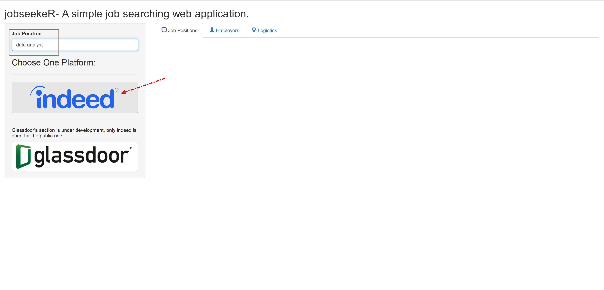
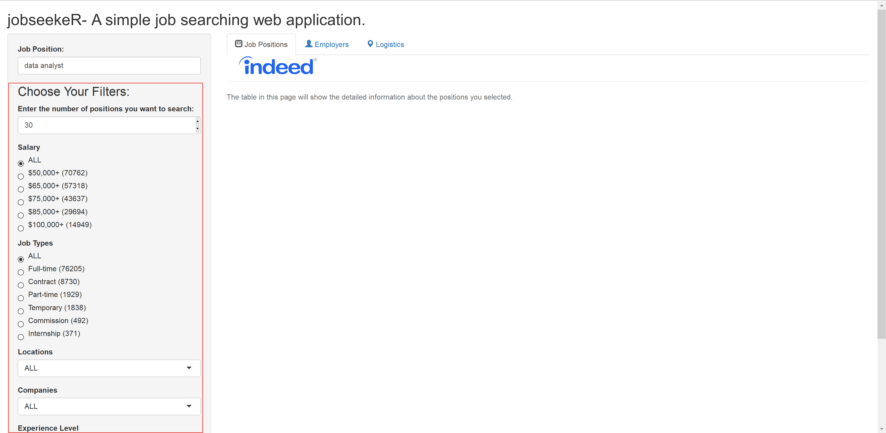

```{r setup, include=FALSE}
knitr::opts_chunk$set(echo = FALSE)
```

## Introduction

[`jobseekeR`](https://github.com/JackHo327/jobseekeR) is one of my personal side projects, and it is a simple shiny-based job searching platform.

Currently, it can support:

- [Indeed.com](www.indeed.com) (I released its first [version 0.1.0](https://jenhichho327.shinyapps.io/jobseekeR/) for public testing)

In the future, I plan to make it support:

- [Glassdoor](www.glassdoor.com) (*to be cont'd*)
- [Lagou.com](https://www.lagou.com/) (*to be cont'd*)
- and some other popular job searching platform (TBA)

## Packages Used
The packages that I used are list below:

- [shiny](https://shiny.rstudio.com/)
- [shinyjs](https://github.com/daattali/shinyjs)
- [dplyr](https://github.com/tidyverse/dplyr)
- [stringr](https://github.com/tidyverse/stringr)
- [leaftlet](https://rstudio.github.io/leaflet/)
- [plotly](https://plot.ly/r/)
- [rvest](https://cran.r-project.org/web/packages/rvest/index.html)
- [curl](https://cran.r-project.org/web/packages/curl/index.html)
- [data.table](https://cran.r-project.org/web/packages/data.table/index.html)
- [ggmap](https://github.com/dkahle/ggmap)
- [shinysky](https://github.com/AnalytixWare/ShinySky)

## Quick Start

Once you open the main page of [`jobseekeR`]([version 1-1.0.1](https://jenhichho327.shinyapps.io/jobseekeR/)), you will see a picture below:

<div style="width:80%;height:80%;position:absolute;margin-risght:10%; margin-left:10%;" >

</div>

******

Thne you should get an alarm/request to access you current location from the browser.

Just allow it because it will affect the results in `leaflet`.

<div style="width:80%;height:80%;position:absolute;margin-right:10%; margin-left:10%;" >

</div>

******

After you entering the job positions, then temporarily, you could only click the indeed.com.

<div style="width:80%;height:80%;position:absolute;margin-right:10%; margin-left:10%;" >

</div>

******

After choosing the platform, then it will automatic load some scripts to download some essential filters.

<div style="width:80%;height:80%;position:absolute;margin-right:10%; margin-left:10%;" >

</div>

******

You could flexably set your filters and after clicking the **Search** button in the bottom of the left panel, then the platform will start computation and fetching data for you.

<div style="width:80%;height:80%;position:absolute;margin-right:10%; margin-left:10%;" >

</div>

******

Wait for a moment, the data will be listed on the tabsets:

<div style="width:80%;height:80%;position:absolute;margin-right:10%; margin-left:10%;" >

</div>


******

<div style="width:80%;height:80%;position:absolute;margin-right:10%; margin-left:10%;" >

</div>

******

<div style="width:80%;height:80%;position:absolute;margin-right:10%; margin-left:10%;" >

</div>
